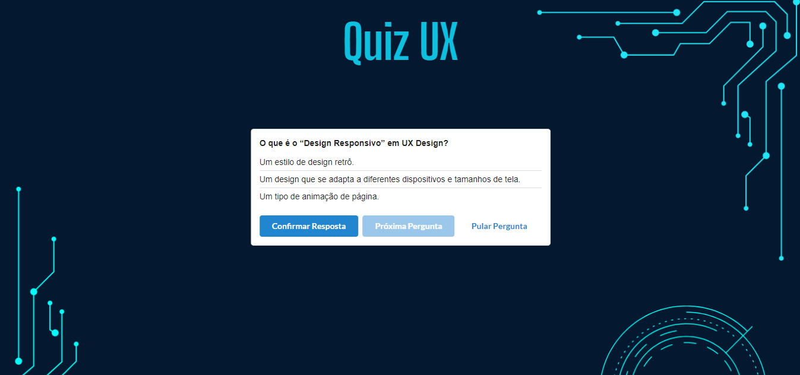

# Site UX 

> Status: Developing ⚠️

## Descrição:
O projeto consiste em um site desenvolvido como parte de um trabalho acadêmico para o curso de Análise e Desenvolvimento de Sistemas. O objetivo principal deste trabalho é proporcionar uma introdução aos conceitos fundamentais de Experiência do Usuário (UX) e demonstrar a aplicação prática desses conceitos através da utilização de tecnologias web como HTML, CSS e JavaScript.

Na barra de navegação localizada na parte inferior do site pode-se observar as seções da página, cada uma abordando diferentes aspectos de UX, tais como:
1. Inicio
2. História
3. Importância da UX
4. Carreiras UX
5. Dicas para melhorar a UX
6. Quiz UX 
7. Integrantes

Além das explicações teóricas, o site oferece um quiz sobre o tema abordado, facilitando a fixação do aprendizado. O quiz contém 10 perguntas por rodada, com conteúdo baseado nas informações do site. Ele foi desenvolvido especificamente para reforçar o conhecimento adquirido. O quiz é responsivo, permitindo o acesso de qualquer dispositivo, com o site se adaptando automaticamente para uma melhor experiência do usuário.

## Tecnologias Utilizadas:

[Visual Studio Code](https://code.visualstudio.com)  - Um editor de código-fonte desenvolvido pela Microsoft.

[JavaScript](https://developer.mozilla.org/en-US/docs/Web/JavaScript) – Linguagem de programação para tornar as páginas web interativas e dinâmicas.

[HTML](https://developer.mozilla.org/en-US/docs/Web/HTML) - Linguagem para estruturar e organizar o conteúdo das páginas web.

[CSS]( https://developer.mozilla.org/en-US/docs/Web/CSS) - Linguagem para estilizar e definir o layout das páginas web.

[Semantic UI]( https://semantic-ui.com) - Framework para criar interfaces web responsivas e estilizadas de forma mais rápida e intuitiva.

## Lincença

Este projeto está licenciado sob a Licença Creative Commons Não Comercial [CC BY-NC](https://creativecommons.org/licenses/by-nc/4.0/legalcode).

## Autores

[Ellen Guimarães](https://github.com/EllenGui)

[Giovane Henrique](https://github.com/GiovaneAlves)

[Rayssa Lima Costa](https://github.com/Rayssa046)

[Tamires Rodrigues de Oliveira](https://github.com/Tamires95378)

[Thalisson Rezende](https://github.com/Thalissonrezende)

